# SodaShip Project Guidance

## Goal
SodaShip is a playful static website for Lillian's knitted hobby products.

## Brand
- Store name: SodaShip
- Creator: Lillian
- Contact email: Lillian@sodaship.com
- Website: www.sodaship.com
- Tagline direction: knitted by Lillian

## Style
- Make the site feel like a cheerful 10-year-old made it with care.
- Prefer bright pastel colors, playful shapes, simple language, and a handmade school-project feeling.
- Keep edits small and easy to understand.
- Avoid making the site look too polished, corporate, or like a generic ecommerce template.

## Technical Notes
- This is a static GitHub Pages site.
- Use plain HTML, CSS, JavaScript, and SVG.
- Keep links and assets relative so they work on GitHub Pages.
- The custom domain is set in `CNAME`.
- The logo lives in `logo.svg`; HTML pages reference it with `logo.svg?v=2` to avoid stale browser cache.

## Important Files
- `index.html`: home page
- `products.html`: product list
- `about.html`: creator/about page
- `contact.html`: contact information
- `styles.css`: shared site styling
- `logo.svg`: SodaShip logo artwork
- `script.js`: small shared JavaScript

## Workflow
- Before editing, inspect the current file so recent changes are preserved.
- Do not remove user-made edits unless explicitly asked.
- When changing any page header, compare it against `index.html` and keep the header markup, navigation links, logo reference, and shared logo sizing consistent across all pages.
- After changing logo references or assets, check every page still points to the correct relative path.
- For GitHub Pages issues, verify that changed files are committed and pushed to `main`.

## Mermaid Preview Test Snippets
These snippets are for testing which Mermaid diagram types render in the current Markdown preview. Some preview extensions may not support every Mermaid beta diagram type yet.

### Flowchart
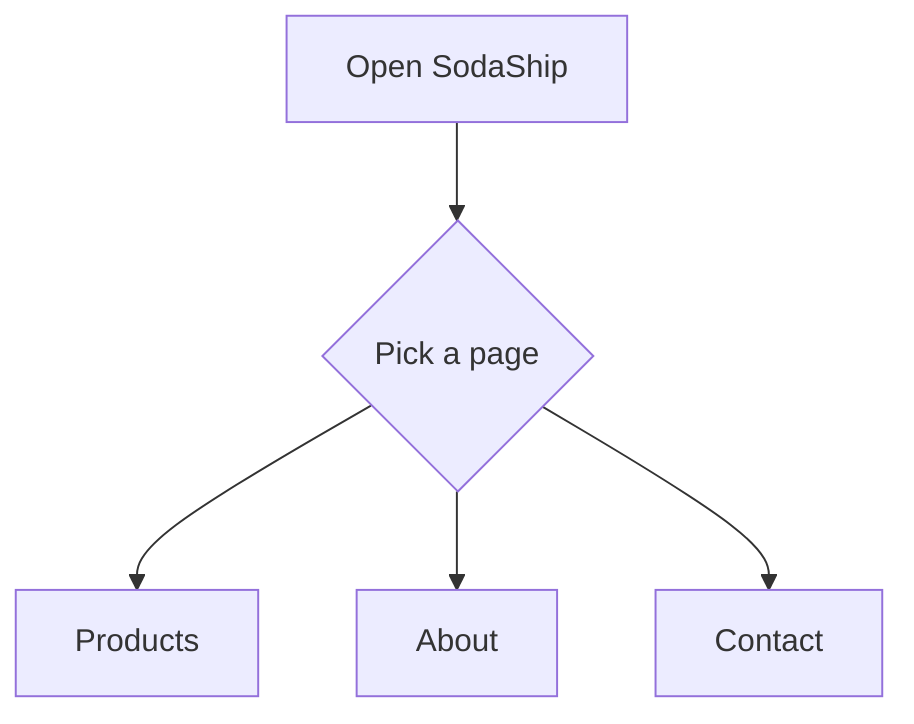

### Sequence Diagram
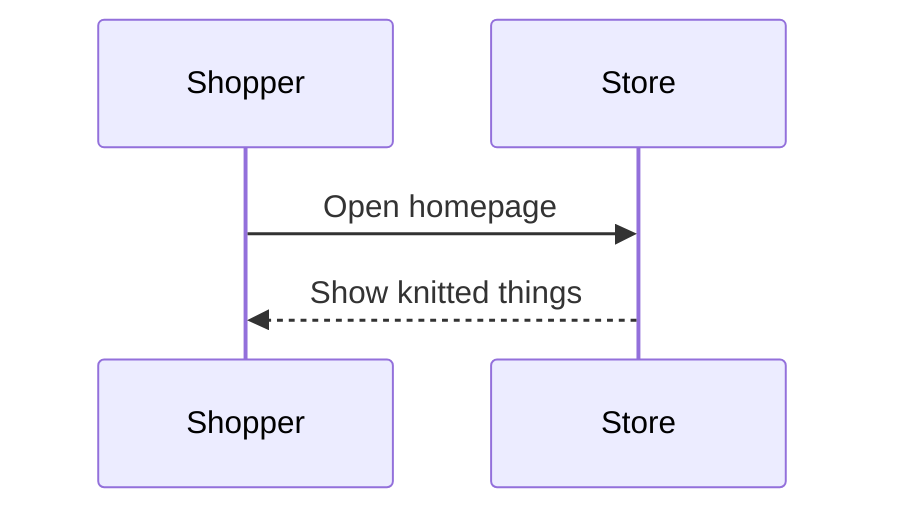

### Class Diagram
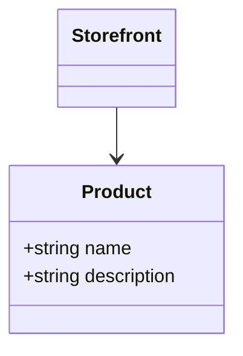

### State Diagram
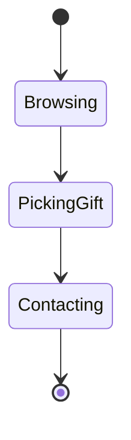

### Entity Relationship Diagram
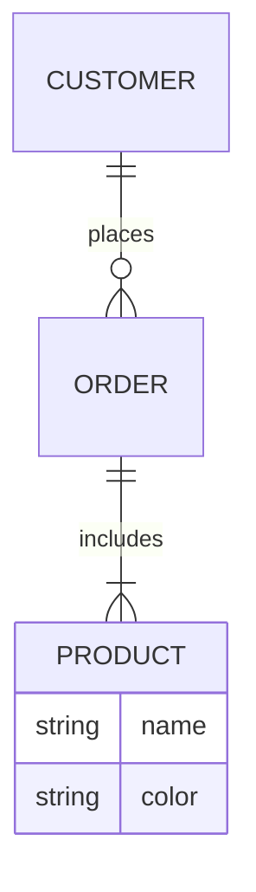

### User Journey
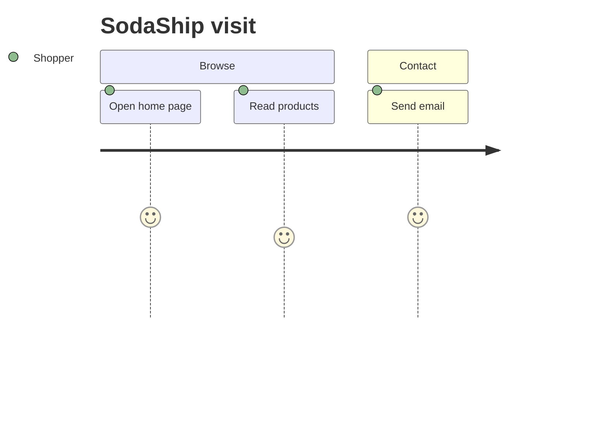

### Gantt
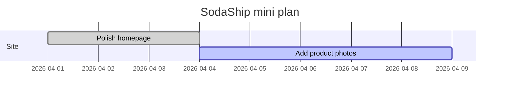

### Pie Chart
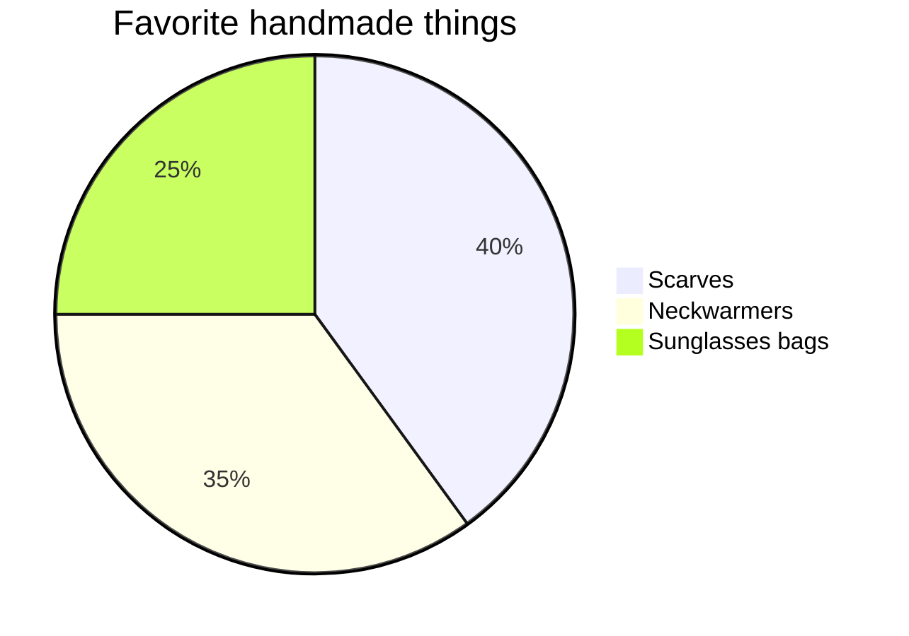

### Quadrant Chart
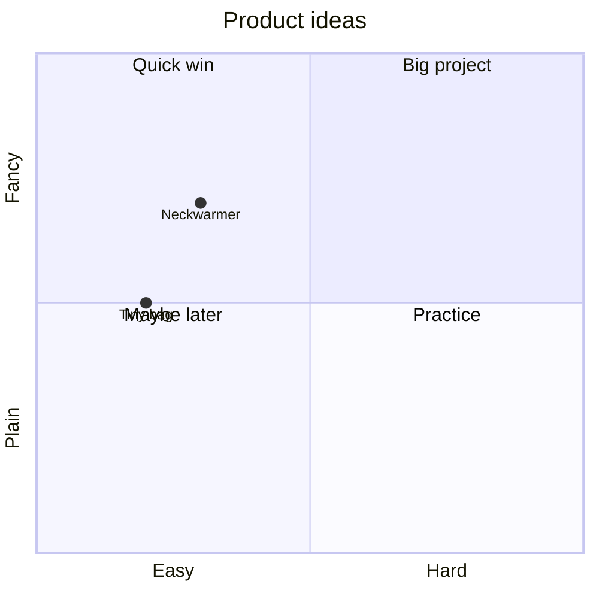

### Requirement Diagram
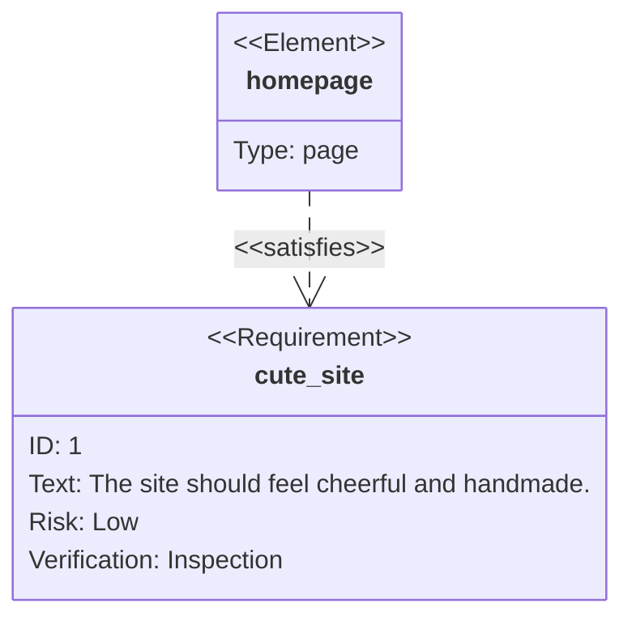

### GitGraph
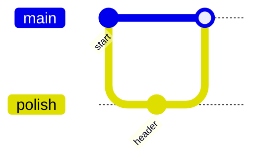

### C4 Diagram
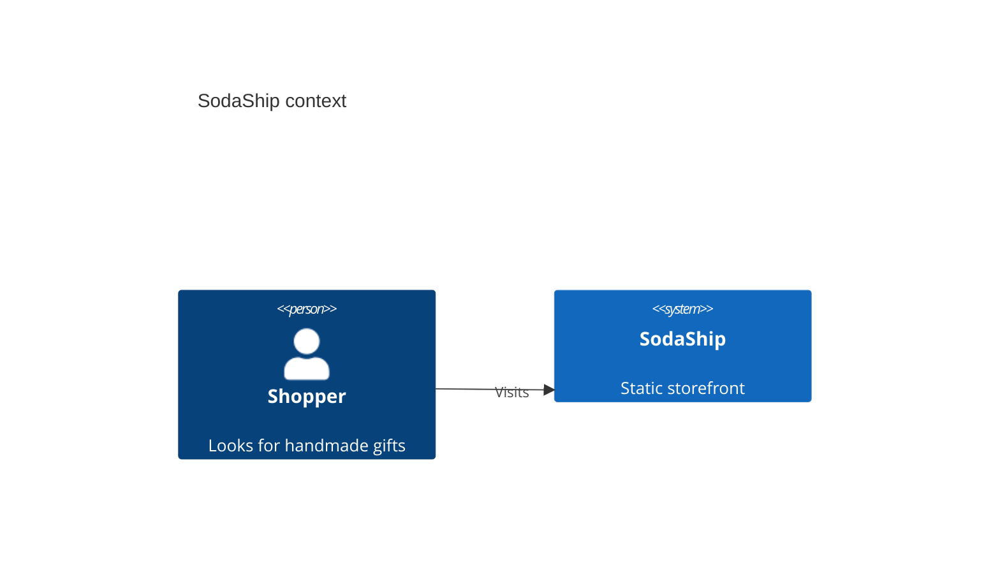

### Mindmap
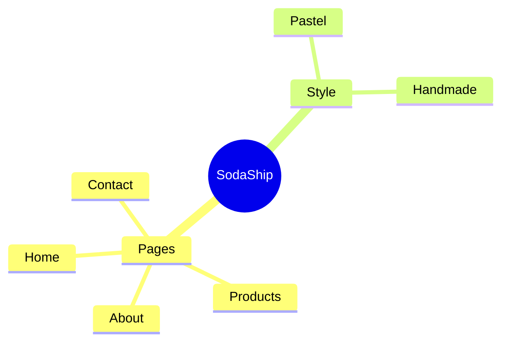

### Timeline
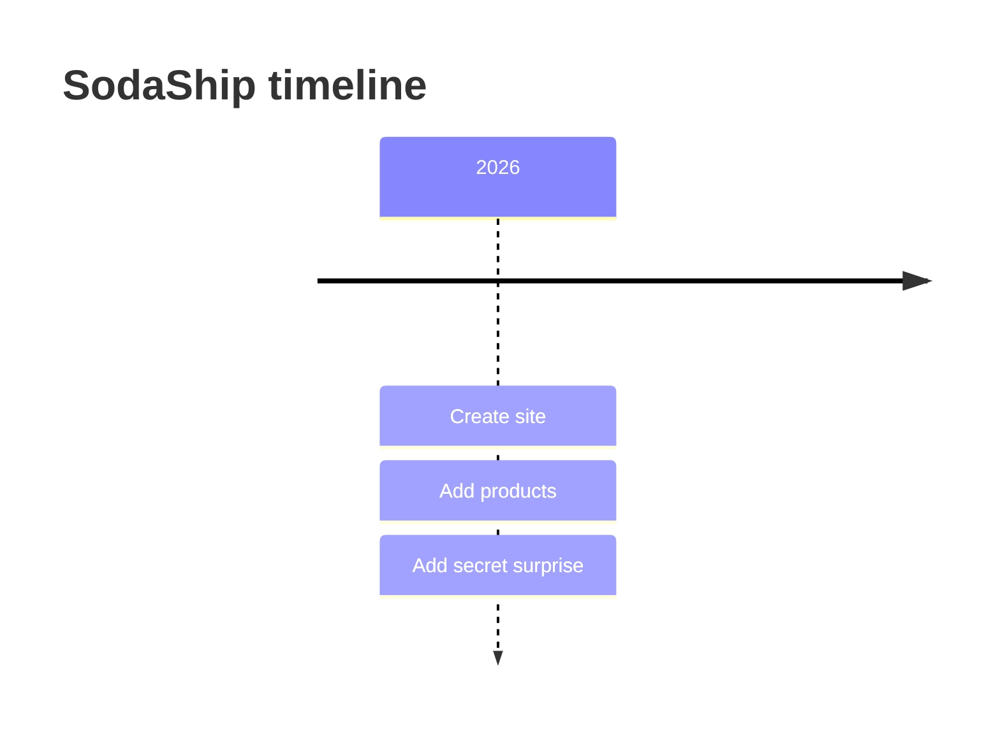

### ZenUML
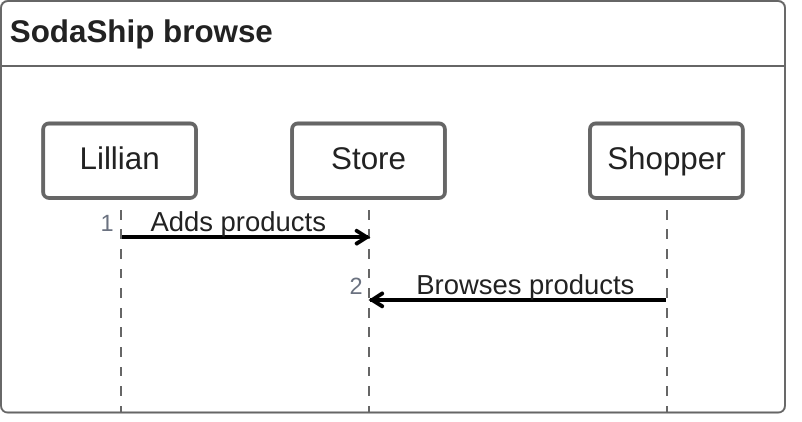

### Sankey
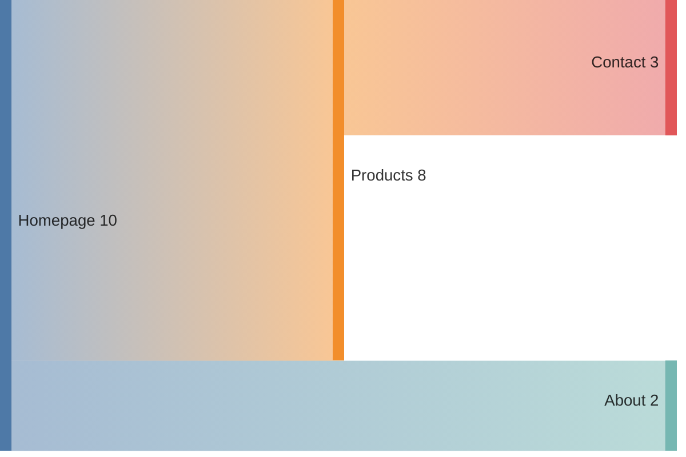

### XY Chart
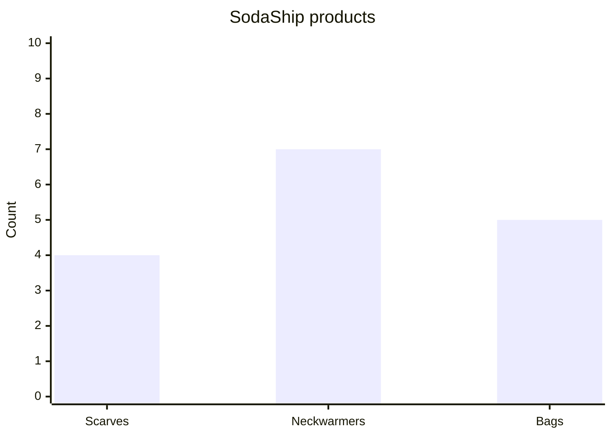

### Block Diagram
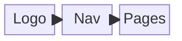

### Packet
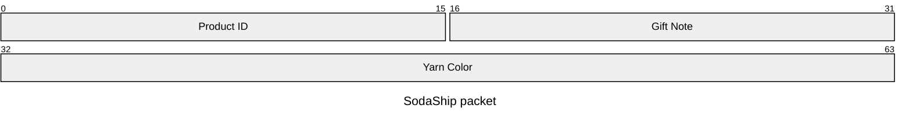

### Kanban
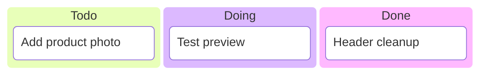

### Architecture
```mermaid
architecture-beta
    group site(cloud)[SodaShip site]
    service pages(server)[HTML pages] in site
    service assets(disk)[CSS and SVG assets] in site
    pages:R --> L:assets
```

### Radar
```mermaid
radar-beta
    title SodaShip style
    axis cute, simple, colorful, handmade
    curve site{9, 8, 10, 9}
```

### Treemap
```mermaid
treemap-beta
    "SodaShip"
        "Pages"
            "Home": 1
            "Products": 1
            "About": 1
            "Contact": 1
        "Assets"
            "Logo": 1
            "Styles": 1
```

### Venn
```mermaid
venn-beta
    set Makers
    set Shoppers
    union Makers,Shoppers
```

### Ishikawa
```mermaid
ishikawa
    Cheerful storefront
        Style
            Pastel colors
            Playful shapes
        Content
            Simple words
            Handmade products
```

### TreeView
```mermaid
treeView-beta
    "1_sodaship_storefront"
        "index.html"
        "products.html"
        "about.html"
        "contact.html"
        "styles.css"
        "script.js"
```
